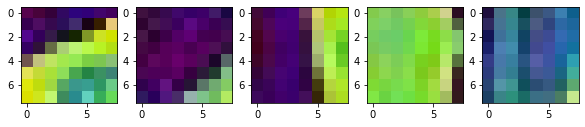

This is a simple walkthrough of implementing a bag-of-words model for image representation, and K-Nearest Neighbours algorithm for classification. A 'clustering and classification' approach. The project code can be found [here](https://github.com/mwcoleman/BoVW-classifier)


A single model using this approach achieved 79% accuracy on the fashion-mnist dataset (using the standard test set for evaluation). Running three individual models (parameters given below) with a majority vote mechanism increased accuracy to ~82%. The steps below are described (for the most part) for a single model, however it is the same for all.

<br>

### __Steps__


1. Preprocessing
2. Feature extraction and clustering
3. Image representation as a bag of words
4. Prediction

<br>


## 1. Preprocessing

We are using the fashion-mnist data set in csv form which can be found [here](https://www.kaggle.com/zalando-research/fashionmnist). We load and reshape with numpy:


```python
## Data preprocessing
test_np = np.genfromtxt ('./data/fashion-mnist_test.csv', delimiter=",")
test_data, test_labels = test_np[1:,1:], test_np[1:,0]
test_data = test_data.reshape(10000, 28, 28).astype('float32')/255

train_np = np.genfromtxt ('./data/fashion-mnist_train.csv', delimiter=",")
train_data, train_labels = train_np[1:,1:], train_np[1:,0]
train_data = train_data.reshape(60000, 28, 28).astype('float32')/255
```
<br>  

## 2. Feature Extraction and Clustering


### Feature Extraction


The fashion-mnist dataset contains images in 10 classes with the following properties:
- No scale variance
- No rotation variance
- Greyscale
- No translation variance (images are centered)
- No projective variance

As such, a simple feature descriptor is suitable for the task. The HOG (Histogram of Gradients) descriptor is a good option due to its simplicity. This is implemented using skimage, with parameter `return_as_vector = True`.

It is possible to first pre-process each image into 'patches' of a certain size, with optional overlap/stride (e.g. 8x8 patch with 4 overlap) and compute HOG on each of these. This controls the density of our feature descriptor and offers more fine-grained control than the standard skimage package.

The three independent models have these parameters (found empirically):  
`km=100, patch=8, stride=4, cells=4, blocks=2, orients=8`  
`km=100, patch=14, stride=7, cells=7, blocks=2, orients=12`  
`km=100, patch=28, stride=1, cells=9, blocks=2, orients=12`  

*Where:*  
  
`km` :  #clusters / dictionary size (a.k.a the words)  
`patch` : 'window size' to calculate HOG over (a patch of 8 is an 8x8 window)   
`stride` : window stride  
  
(the remaining parameters are as per the skimage HOG method.)

<br>

The number (and length) of feature descriptor vectors each image has will depend on these parameters. It is important to note for the case when `patch` size is smaller than the image size, each image will have multiple feature vectors describing it. 
<br>
### Clustering


I used the K-means clustering algorithm with euclidian distance metric. Random cluster initialisation yielded very poor results, so I chose to use a method that initialises clusters by sampling from the training data points with probability equal to the inverse of the distance between potential points, with the aim to achieve a better spread of clusters. This method is referred to as [k++ initialisation](http://ilpubs.stanford.edu:8090/778/1/2006-13.pdf), here is the code:


```python
# First centroid is just the first feature vector.
centroids = [fv[0]]

for _ in range(1, k):
    # Calcuate probability based on the distance between points
    distance = np.array([min([np.inner(k-v,k-v) for k in centroids]) for v in fv])
    probs = distance/distance.sum()
    probs = probs.cumsum()

    # Rejection sampling to probabilistically pick centroid far away from existing
    r = np.random.rand()

    for j, p in enumerate(probs):
        if r < p:
            i = j
            break

    # Set the next centroid as the chosen vector from our feature vector space
    centroids.append(fv[i])
```

After clustering, there are 100 centroids that could be interpreted as the 'main parts' of the collective image set. A sample of these can be seen below:


```python
images = []
for i in range(1,100,10):
    images.append(io.imread(f'./centroid_images/dict1/{i}.jpeg'))

fig,ax = plt.subplots(1,5, figsize=(10,10))
for i in range(5):
    ax[i].imshow(images[i])
    ax[i].set_axis_off

```


    

    


The complete set that was generated can be seen [here](https://github.com/mwcoleman/BoVW-classifier/tree/main/centroid_images).

<br>


## 3. Image representation as a bag of words


Once we have our vocabulary/dictionary of centroids, we now need to represent every image in our dataset (train+test) in terms of relative amounts of these components. This is done with soft assignment, with assignment inverserly proportional to the l2 norm in order to penalise the distance. (The particular metric is flexible as long as it meets the intent).


For the case of images having multiple feature vectors, the overall assignment vector is simply the average.

<br>


## 4. Prediction


Following step 3, (for each model) every image is defined as a 100-D vector, each dimension corresponding to an assignment weighting to the corresponding cluster. To predict we use a standard K-NN algorithm with the distance metric chosen as the chi-squared difference as it performed the best (in comparison to euclidean / histogram intersection).
